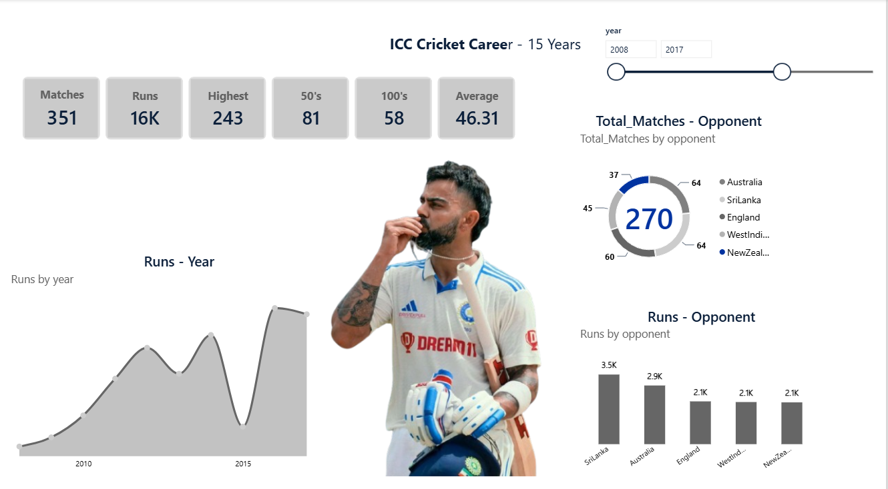

# Virat Kohli Score Analytics 🏏

A Microsoft Power BI analytics dashboard and dataset analyzing the batting performance and match records of Virat Kohli.

## 📊 Dashboard Preview



## 📁 Repository Structure

- `Virat Kohli Score DashBoard.pbix` - Power BI Dashboard project file
- `Sources/Source.csv` - Raw dataset containing match and score details
- `Dashboard_img.png` - Visual snapshot of the Power BI report

## 🚀 Getting Started

1. Download or clone this repository:
   ```bash
   git clone https://github.com/1608Suraj/Viratkohli_Analytics.git
   ```
2. Open `Virat Kohli Score DashBoard.pbix` using **Microsoft Power BI Desktop**.
3. Explore the visual analytics, charts, and batting statistics.
